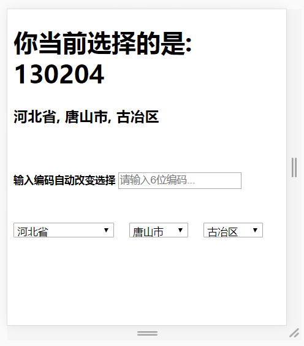

# AreaCn

This project was generated with [Angular CLI](https://github.com/angular/angular-cli) version 1.0.6.

## 故事
最近业余学习 Angular，加入了两个 QQ 技术群。有位兄弟在群里最近一直吵吵着 省市区三级联动 的开发问题。我看他吵吵了差不多一个礼拜，还在吵吵。我就想，这个究竟有多难？刚好，我准备尝试下使用 github 看看，就花了半天时间，创建了这个项目。十几年的 C 开发经历之后，第一个开源项目居然是 TypeScript 项目，想想也是挺有意思的。

## Development server

Run `ng serve` for a dev server. Navigate to `http://localhost:4200/`. The app will automatically reload if you change any of the source files.

## Code scaffolding

Run `ng generate component component-name` to generate a new component. You can also use `ng generate directive|pipe|service|class|module`.

## Build

Run `ng build` to build the project. The build artifacts will be stored in the `dist/` directory. Use the `-prod` flag for a production build.

## Running unit tests

Run `ng test` to execute the unit tests via [Karma](https://karma-runner.github.io).

## Running end-to-end tests

Run `ng e2e` to execute the end-to-end tests via [Protractor](http://www.protractortest.org/).
Before running the tests make sure you are serving the app via `ng serve`.

## Further help

To get more help on the Angular CLI use `ng help` or go check out the [Angular CLI README](https://github.com/angular/angular-cli/blob/master/README.md).
